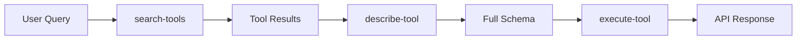

# Tools Reference

The F5XC API MCP Server exposes **1,426 API tools** across 7 domains through a dynamic discovery
architecture that reduces token consumption by 95%+.

!!! info "Dynamic Discovery Architecture"
    Instead of loading all tools upfront (~535K tokens), the server uses 6 meta-tools that load
    schemas on-demand. Initial cost: ~500 tokens. Per-tool cost: ~375 tokens.

## Discovery Workflow



## Meta-Tools

These 6 tools are always available and provide access to all 1,426 API operations.

### f5xc-api-server-info

Get server status, authentication state, and capabilities.

| Parameter | Type | Required | Description |
|-----------|------|----------|-------------|
| *(none)* | - | - | No parameters required |

**Example Response:**

```json
{
  "server": "f5xc-api-mcp",
  "version": "1.0.0",
  "mode": "execution",
  "authenticated": true,
  "domains": ["waap", "dns", "core", "network", "site", "security", "appstack"],
  "totalTools": 1426
}
```

---

### f5xc-api-search-tools

Search for API tools using natural language queries.

| Parameter | Type | Required | Description |
|-----------|------|----------|-------------|
| `query` | string | Yes | Natural language query (e.g., "create load balancer") |
| `limit` | number | No | Max results (default: 10, max: 50) |
| `domains` | array | No | Filter by domain(s): waap, dns, core, network, site, security, appstack |
| `operations` | array | No | Filter by operation(s): create, get, list, update, delete |

**Example:**

```json
{
  "query": "http load balancer",
  "domains": ["waap"],
  "operations": ["create", "list"]
}
```

---

### f5xc-api-describe-tool

Get full schema and documentation for a specific tool.

| Parameter | Type | Required | Description |
|-----------|------|----------|-------------|
| `toolName` | string | Yes | Exact tool name (e.g., `f5xc-api-waap-http-loadbalancer-create`) |

!!! tip "Find Tool Names First"
    Use `f5xc-api-search-tools` to discover tool names before calling describe.

**Response includes:**

- Full parameter schema with types and validation
- Request body JSON schema
- f5xcctl CLI equivalent command
- Terraform resource example
- Prerequisites and dependencies

---

### f5xc-api-execute-tool

Execute a discovered API tool.

| Parameter | Type | Required | Description |
|-----------|------|----------|-------------|
| `toolName` | string | Yes | The exact tool name to execute |
| `pathParams` | object | No | Path parameters (e.g., `{ namespace: "default", name: "my-lb" }`) |
| `queryParams` | object | No | Query parameters for the request |
| `body` | object | No | Request body for POST/PUT/PATCH operations |

**Behavior:**

- **Authenticated mode**: Executes API call against your F5XC tenant
- **Documentation mode**: Returns CLI commands and curl examples

---

### f5xc-api-search-resources

Search for consolidated resources (more efficient than tool search).

!!! info "Resource Consolidation"
    Resources combine related CRUD tools. One result per resource instead of 5 separate tools.

| Parameter | Type | Required | Description |
|-----------|------|----------|-------------|
| `query` | string | Yes | Natural language query |
| `limit` | number | No | Max results (default: 10) |
| `domains` | array | No | Filter by domain(s) |

**Example:**

```json
{
  "query": "origin pool",
  "domains": ["waap"]
}
```

**Response shows available operations:**

```json
{
  "resourceName": "f5xc-api-waap-origin-pool",
  "operations": ["create", "get", "list", "update", "delete"]
}
```

---

### f5xc-api-execute-resource

Execute a CRUD operation on a consolidated resource.

| Parameter | Type | Required | Description |
|-----------|------|----------|-------------|
| `resourceName` | string | Yes | Resource name (e.g., `f5xc-api-waap-http-loadbalancer`) |
| `operation` | string | Yes | Operation: create, get, list, update, delete |
| `pathParams` | object | No | Path parameters |
| `queryParams` | object | No | Query parameters |
| `body` | object | No | Request body |

---

## Tool Naming Convention

```text
f5xc-api-{domain}-{resource}-{operation}
```

**Examples:**

- `f5xc-api-waap-http-loadbalancer-create`
- `f5xc-api-dns-dns-zone-list`
- `f5xc-api-core-namespace-get`

---

## Domains

### WAAP (Web App & API Protection)

| Resource | Operations |
|----------|------------|
| HTTP Load Balancer | create, get, list, update, delete |
| Origin Pool | create, get, list, update, delete |
| App Firewall | create, get, list, update, delete |
| Rate Limiter | create, get, list, update, delete |
| Service Policy | create, get, list, update, delete |

### DNS

| Resource | Operations |
|----------|------------|
| DNS Zone | create, get, list, update, delete |
| DNS Load Balancer | create, get, list, update, delete |
| DNS LB Pool | create, get, list, update, delete |

### Network

| Resource | Operations |
|----------|------------|
| Network Connector | create, get, list, update, delete |
| Network Firewall | create, get, list, update, delete |
| Enhanced Firewall Policy | create, get, list, update, delete |

### Site

| Resource | Operations |
|----------|------------|
| AWS VPC Site | create, get, list, update, delete |
| Azure VNet Site | create, get, list, update, delete |
| GCP VPC Site | create, get, list, update, delete |
| Customer Edge | create, get, list, update, delete |

### AppStack

| Resource | Operations |
|----------|------------|
| K8s Cluster | create, get, list, update, delete |
| Virtual K8s | create, get, list, update, delete |
| Workload | create, get, list, update, delete |

### Security

| Resource | Operations |
|----------|------------|
| Malicious User Detection | create, get, list, update, delete |
| Bot Defense | create, get, list, update, delete |
| API Discovery | create, get, list, update, delete |

### Core

| Resource | Operations |
|----------|------------|
| Namespace | create, get, list, update, delete |
| Certificate | create, get, list, update, delete |
| Cloud Credentials | create, get, list, update, delete |
| Secret | create, get, list, update, delete |

---

## Response Formats

### Documentation Mode (Unauthenticated)

When credentials are not configured, tools return documentation:

```json
{
  "mode": "documentation",
  "tool": "f5xc-api-waap-http-loadbalancer-create",
  "description": "Creates an HTTP Load Balancer",
  "parameters": {},
  "f5xcctl_command": "f5xcctl apply -f http_lb.yaml",
  "terraform_resource": "volterra_http_loadbalancer",
  "terraform_example": "resource \"volterra_http_loadbalancer\" {...}",
  "prerequisites": ["namespace must exist", "origin_pool required"],
  "subscription_tier": "STANDARD"
}
```

### Execution Mode (Authenticated)

When credentials are configured, tools execute API calls:

```json
{
  "mode": "execution",
  "tool": "f5xc-api-waap-http-loadbalancer-create",
  "status": "success",
  "response": {},
  "resource_url": "https://tenant.console.ves.volterra.io/..."
}
```

---

## Prompts

Pre-built workflow prompts for common multi-step operations.

### deploy-http-loadbalancer

Deploy a complete HTTP Load Balancer with origin pool.

| Argument | Required | Description |
|----------|----------|-------------|
| namespace | Yes | Target namespace |
| name | Yes | Load balancer name |
| domain | Yes | Domain name (e.g., app.example.com) |
| backend_ip | Yes | Backend server IP |
| backend_port | No | Backend port (default: 80) |
| enable_waf | No | Enable WAF (default: false) |

### configure-waf

Configure Web Application Firewall protection.

| Argument | Required | Description |
|----------|----------|-------------|
| namespace | Yes | Target namespace |
| name | Yes | WAF policy name |
| loadbalancer | Yes | HTTP Load Balancer to protect |
| mode | No | blocking or monitoring (default: blocking) |

### create-multicloud-site

Deploy an F5XC site in AWS, Azure, or GCP.

| Argument | Required | Description |
|----------|----------|-------------|
| namespace | Yes | Target namespace |
| name | Yes | Site name |
| cloud | Yes | aws, azure, or gcp |
| region | Yes | Cloud region |
| vpc_id | Yes | VPC/VNet ID |

### generate-terraform

Export F5XC resources as Terraform configuration.

| Argument | Required | Description |
|----------|----------|-------------|
| namespace | Yes | Namespace to export |
| resource_type | No | Specific resource type |
| name | No | Specific resource name |

---

## Subscription Tiers

!!! warning "Tier Requirements"
    Some resources require specific F5XC subscription tiers.

| Tier | Resources |
|------|-----------|
| NO_TIER | namespace, certificate, secret, cloud_credentials |
| STANDARD | http_loadbalancer, origin_pool, dns_zone, health_check |
| ADVANCED | app_firewall, bot_defense, api_discovery, malicious_user_detection |

---

## Next Steps

- [HTTP Load Balancer](http-loadbalancer.md) - Detailed load balancer documentation
- [Origin Pool](origin-pool.md) - Backend pool configuration
- [App Firewall](app-firewall.md) - WAF configuration
- [f5xcctl Integration](../integrations/f5xcctl.md) - CLI equivalents
- [Terraform Integration](../integrations/terraform.md) - Infrastructure as code
